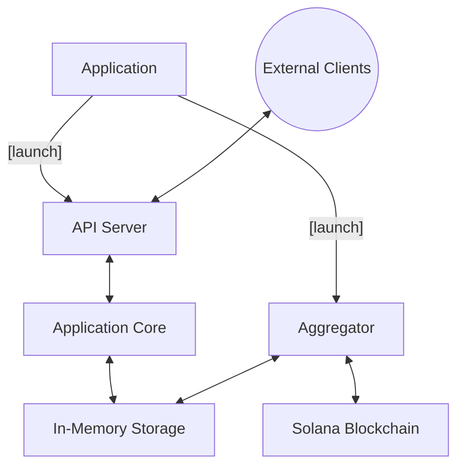

# sol-tx-aggregator
Solana Transaction and Account Aggregator

**IMPORTANT:** The process of the transaction and accounts is not 100% accurate, since I needed to spend some time on reading the Solana blockchain documentation and implementing the solution, because I had no experience with Solana blockchain before. I think there are some edge cases that are not handled correctly, but I prefer to focus on the implementation as a whole instead of spending more time on figuring out Transaction and Account datastructure on Solana blockchain.

## 0. Table of Contents

- [1. Introduction](#1-introduction)
- [2. System Architecture](#2-system-architecture)
- [3. Core Components](#3-core-components)
- [4. Design Patterns and Architectural Decisions](#4-design-patterns-and-architectural-decisions)
- [5. Data Flow](#5-data-flow)
- [6. Key Technologies and Libraries](#6-key-technologies-and-libraries)
- [7. Configuration](#7-configuration)
- [8. Known Limitations and Future Improvements](#8-known-limitations-and-future-improvements)
- [9. API Documentation](#9-api-documentation)
- [10. Running the project](#10-running-the-project)
## 1. Introduction

`sol-tx-aggregator` is a Rust-based application that aggregates Solana transactions and accounts. This document outlines the technical design and architecture of the project.

## 2. System Architecture

The project follows a modular architecture, with the following main components:

1. API Server
2. Application Core
3. Aggregator (Solana Blockchain Synchronization)
4. In-Memory Storage

### 2.1 High-Level Architecture Diagram



This diagram illustrates the main components of the system and their interactions:

- External Clients communicate with the API Server
- The API Server interacts with the Application Core
- The Application Core manages data in the In-Memory Storage
- The Aggregator synchronizes data between the Application Core and the Solana Blockchain

## 3. Core Components

### 3.1 API Server

The API Server handles incoming HTTP requests and routes them to the appropriate handlers in the Application Core.

Key features:
- Asynchronous server using Tokio
- Graceful shutdown mechanism

Main file: `src/service/api.rs`


### 3.2 Application Core

The Application Core contains the main business logic of the system.

Key features:
- Implements the `Application` trait
- Graceful shutdown support

Main file: `src/application/app.rs`


### 3.3 Aggregator

The Aggregator is responsible for synchronizing data with the Solana Blockchain.

Key features:
- Polls for new blocks at regular intervals
- Processes and stores relevant data
- Graceful shutdown support
- Retry mechanism for error handling

Main file: `src/application/aggregator.rs`

### 3.4 In-Memory Storage

Currently, the project uses in-memory storage for data persistence.

Key features:
- Fast read/write operations
- Interfaces designed for easy transition to a persistent database in the future

Main file: `src/infrastructure/memory.rs`

Disadvantages:
- Data is lost on server restart

## 4. Design Patterns and Architectural Decisions

### 4.1 Domain-Driven Design (DDD)

The project follows an approach similar to Domain-Driven Design (DDD) in its code organization. This helps in maintaining a clear separation of concerns and allows for easier expansion and maintenance of the codebase.

### 4.2 Error Handling

All internal error handling is done using the `thiserror` crate. Errors are propagated up to the main function, ensuring consistent error handling throughout the application.

### 4.3 Blockchain Synchronization

The project currently uses polling to synchronize with the Solana blockchain. **WebSockets and the Yellowstone** subscription SDK were not implemented due to limitations with free Helius nodes and public Solana nodes, which do not support notifications for new blocks.

### 4.4 Data Persistence

Due to time constraints, a persistent database has not been implemented. However, the project uses generic interfaces for data storage, allowing for easy future implementation of a Relational Database Management System (RDBMS) or other persistent storage solutions.

### 4.5 Graceful Shutdown

All components of the system support graceful shutdown, ensuring that ongoing operations can be completed or safely terminated before the application exits.

### 4.6 Retry Mechanism

The synchronization process with the Solana blockchain includes a retry mechanism to handle temporary errors or network issues, improving the robustness of the system.

## 5. Data Flow

1. The Aggregator polls the Solana blockchain for new blocks
2. New block data is processed and stored in the In-Memory Storage, sending a notification through tokio channels to notifier.
3. External clients send requests to the API Server
4. The API Server routes requests to the appropriate handler in the Application Core
5. The Application Core processes the request, interacting with the In-Memory Storage if necessary
6. The Application Core returns the result to the API Server
7. The API Server sends the response back to the client

## 6. Key Technologies and Libraries

- Rust (edition 2021)
- Tokio for asynchronous runtime
- Anyhow and Thiserror for error handling
- Solana SDK and Client for interacting with the Solana blockchain to avoid using non-official libraries
- tokio-retry for retry mechanism on RpcClient
- Chronos for time handling
- Dashmap for concurrent hashmap InMemoryDatabase implementation

## 7. Configuration

[Describe how the application is configured, any environment variables, config files, etc.]

## 8. Known Limitations and Future Improvements

1. Data Persistence: Currently, all data is stored in-memory. If the server crashes or is restarted, all data is lost. Implementing a persistent database is a high-priority future improvement.

2. Blockchain Synchronization: The current polling method for blockchain synchronization could be improved by implementing WebSocket support or using the Yellowstone subscription SDK when available on the desired nodes.

3. CI/CD pipeline

4. Monitoring and observability

5. Persistent storage

6. WebSocket support for blockchain synchronization

7. Integration tests using `testcontainers` crate


### 9. API Documentation
The following REST API endpoints are available:

#### 1. Get Transactions

- **Endpoint**: `/transactions`
- **Method**: GET
- **Query Parameters**:
  - `id`: (optional) Get a specific transaction by ID
  - `day`: (optional) Get transactions for a specific date (format: YYYY-MM-DD)
  - `sender`: (optional) Get transactions by sender address
  - `receiver`: (optional) Get transactions by receiver address
  - `slot`: (optional) Get transactions by slot number
- **Response**: JSON array of Transaction objects

##### Examples:

- Get all transactions: `GET /transactions`
- Get transaction by ID: `GET /transactions?id=<transaction_id>`
- Get transactions by date: `GET /transactions?day=2023-04-15`
- Get transactions by sender: `GET /transactions?sender=<sender_address>`
- Get transactions by receiver: `GET /transactions?receiver=<receiver_address>`
- Get transactions by slot: `GET /transactions?slot=12345`

#### 2. Get Accounts

- **Endpoint**: `/accounts`
- **Method**: GET
- **Query Parameters**:
  - `address`: (optional) Get a specific account by address
- **Response**: JSON array of Account objects

##### Examples:

- Get all accounts: `GET /accounts`
- Get account by address: `GET /accounts?address=<account_address>`

### Response Formats

#### Transaction Object

```json
{
  "id": "string",
  "slot": "number",
  "sender": "string",
  "receiver": "string",
  "amount": "number",
  "timestamp": "string (ISO 8601 format)"
}
```

#### Account Object

```json
{
  "address": "string",
  "balance": "number",
  "last_updated": "string (ISO 8601 format)"
}
```

### Error Responses

- `400 Bad Request`: Invalid input parameters
- `404 Not Found`: Resource not found
- `500 Internal Server Error`: Server-side error

Note: All endpoints support CORS (Cross-Origin Resource Sharing) for browser-based clients.

## 10. Running the project

To see the available options, run the following command:
```bash
cargo run --bin sol-tx-aggregator -- --help
```

To run the project, use the following command:
```bash
cargo run --bin sol-tx-aggregator -- --rpc-endpoint <rpc-endpoint>
```
